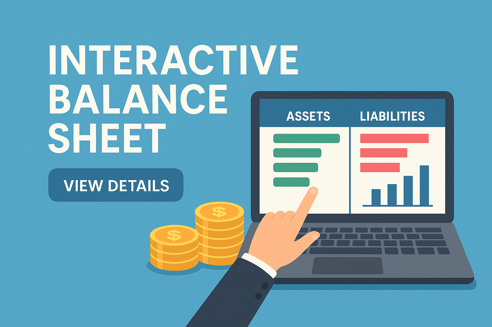

# 📊 Balance Contable Interactivo

Este proyecto es una aplicación web que permite **gestionar y visualizar balances contables** de forma dinámica e intuitiva. Está pensada para ayudar a usuarios y administradores a llevar un control claro de activos, pasivos y patrimonio mediante una interfaz interactiva.



## 📄 Descripción

La herramienta ofrece una visión estructurada del estado financiero de una empresa o proyecto, desglosando **activos y pasivos** en tiempo real. Incluye formularios para registrar elementos contables y gráficos que representan el equilibrio financiero.

## 🧩 Estructura del Proyecto

```
interactive-balance
├── index.html           # Estructura HTML de la app
├── css/
│   └── styles.css       # Estilos personalizados
├── js/
│   ├── main.js          # Lógica general e interacción
│   ├── data.js          # Datos de activos y pasivos
│   └── chart.js         # Configuración de gráficos
├── assets/
│   └── banner.png       # Imagen principal del proyecto
└── README.md            # Este archivo
```

## 🚀 Características

- **Formulario dinámico** para ingresar activos y pasivos.
- **Gráfico de barras** que compara activos vs. pasivos.
- **Resumen contable** automático con balance actualizado.
- **Diseño responsive**, ideal para tablet y escritorio.
- **Validación de datos** e interacción amigable.

## 🔧 Tecnologías Utilizadas

- **HTML5**: Estructura semántica del proyecto.
- **CSS3**: Maquetación y diseño visual.
- **JavaScript (ES6)**: Lógica de aplicación y gestión de datos.
- **Chart.js**: Visualización de gráficos contables.

## 🌟 Cómo Usar

1. Clona este repositorio:

```bash
git clone https://github.com/TU_USUARIO/interactive-balance.git
cd interactive-balance
```

2. Abre el archivo `index.html` en tu navegador.

3. Añade tus activos y pasivos en los formularios correspondientes.

4. Visualiza el resultado contable en el gráfico generado automáticamente.

## 🎯 Futuras Mejoras

- Exportación de balances a PDF o Excel.
- Historial contable y registro por fechas.
- Autenticación de usuarios y gestión de sesiones.
- Enlace con plataformas contables externas (API).

## 🤝 Contribuciones

¡Las contribuciones son bienvenidas!

Si deseas colaborar:

- Abre un *issue* explicando tu mejora.
- Haz un *fork* del repositorio y crea tu rama:

```bash
git checkout -b mejora/tu-feature
```

- Realiza tus cambios y envía un *pull request*.

---

© 2025 Interactive Balance Team. Proyecto académico de gestión financiera visual.
